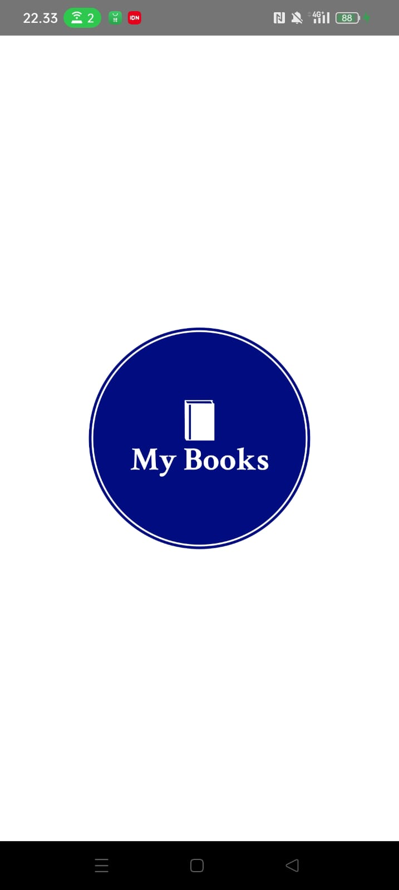
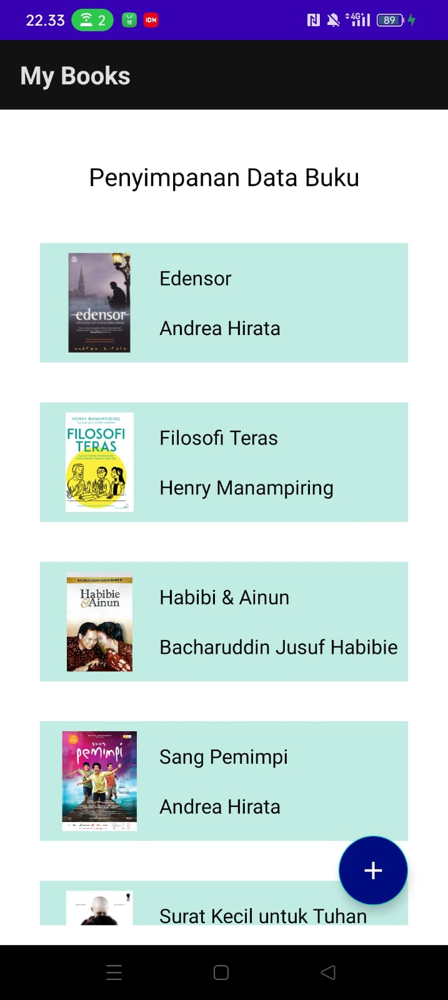
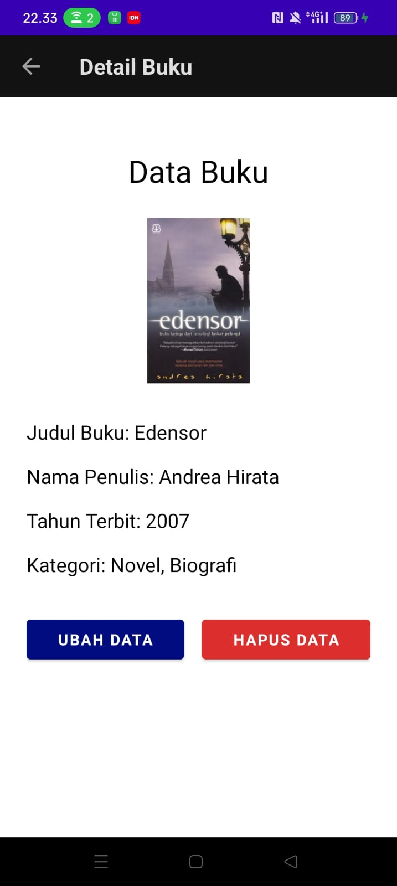
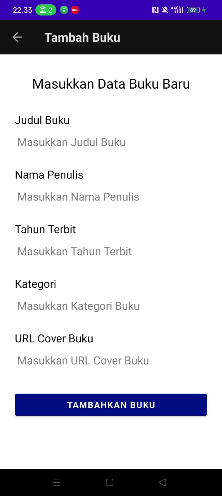
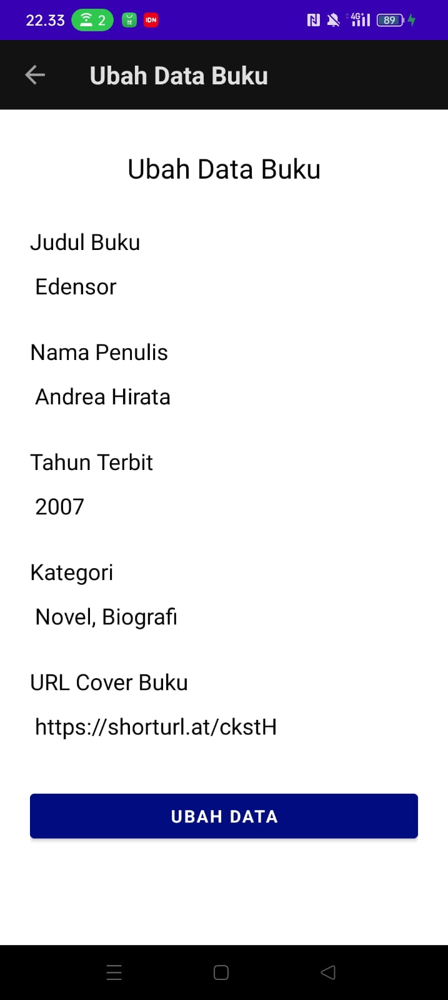
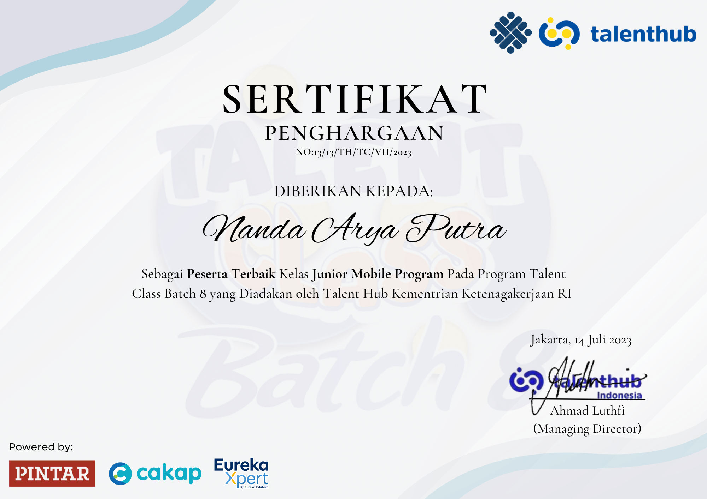
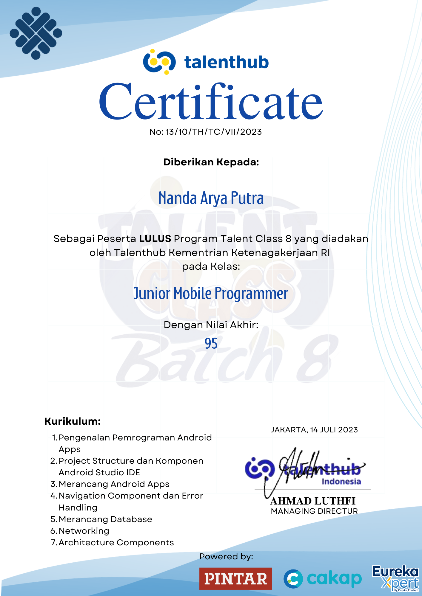

# TalentClass-batch-8

All junior mobile programmer class projects using Android Native Kotlin

## Tugas-tugas
1. Membuat Kode/Program Deteksi Palindrom -> Day 1/palindrom.kt
2. Membuat Aplikasi tampilan login dan show data berserta validasinya -> Day 2/Tugas-Day-2-App
3. Membuat Aplikasi dengan Splashscreen, List Pengguna (RecyclerView), dan Detail data -> Day 3/Tugas-Day-3-App & Day 3/app-debug.apk
4. Membuat Aplikasi dengan Splashscreen, 2 Tab (dibuat dengan tab layout dan view pager) yang berisi daftar pengguna (dibuat dengan recycler view), dan Detail data -> Day 4/Tugas-Day-4-App & Day 4/app-debug.apk
5. Membuat Aplikasi github user list -> Tugas-Day-5-App 
6. (TUGAS AKHIR) Membuat Aplikasi Penyimpanan Data Buku -> Tugas-Day-6-App & Day 6/app-debug.apk

### Show Case Tugas Akhir
Mobile application for store book's data. Build with kotlin and firebase realtime database

    

# Graduation
I managed to be the best participant in the Junior Mobile Programmer Class

I passed with a score of 95 out of 100

